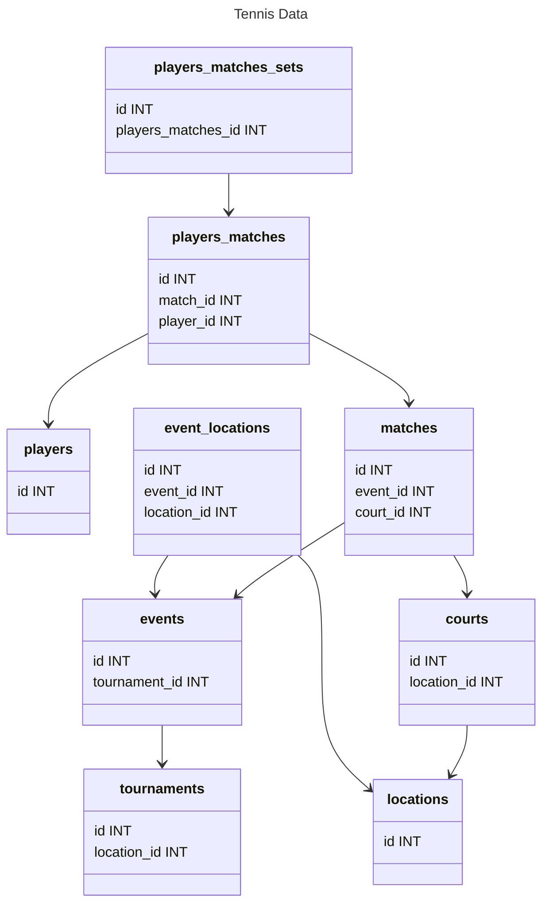

Aprendizaje Automático Para Grandes Volúmenes de Datos
======================================================

Sábado 22 de abril de 2023, clase 9

Asistencia
----------

- [ ] 0214177@up.edu.mx Arroyo Vázquez, Jorge Armando (Armando, IIN) 
- [ ] ediazm@up.edu.mx  Díaz Medina, Eduardo (Lalo, Ext.)
- [ ] 0214020@up.edu.mx Escoto Aceves, María Andrea (Andrea, IID)
- [ ] 0248440@up.edu.mx Estrada Hernández, Héctor Raúl (Raúl, Ext. economía y gestión de negocios)
- [ ] 0214611@up.edu.mx Macías Álvarez, Judith (Judith, IIN)
- [ ] 0205608@up.edu.mx Orozco Alarcón, Javier (Javier, IIN) 
- [ ] 0216072@up.edu.mx Perez, Andrea (Andrea, IID)
- [ ] 0211501@up.edu.mx Ramirez Gonzalez, Jose Carlos (José Carlos, IIN)
- [ ] 0213865@up.edu.mx Valdivia Mendoza, Juan Manuel (JuanMa, Ext. Industrial Ags.)
- [ ] 0215080@up.edu.mx Villalpando Chávez, Natalia (Natalia, IID)

AQUÍ
nombre, lengua, fisica, quimica, gimnasia
"